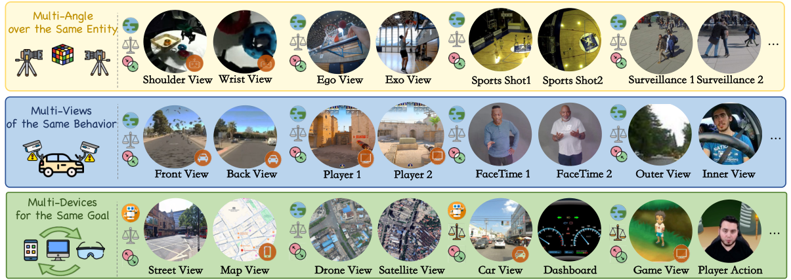
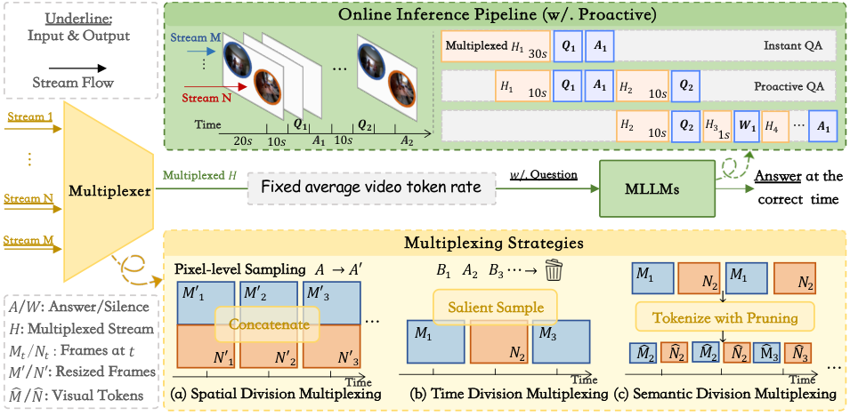

<!-- markdownlint-disable MD033 MD041 -->

# X-Stream: Exploring MLLMs as Multiplexers for Multi-Stream Understanding

<p align="center">
  <a href="https://peiwensun2000.github.io/xstream/"></a>
  <a href="https://huggingface.co/datasets/spw2000/X-stream"></a>
  <a href="https://peiwensun2000.github.io/xstream/"></a>
  <a href="LICENSE"></a>
</p>

Official inference and evaluation code for **X-Stream: Exploring MLLMs as Multiplexers for Multi-Stream Understanding**. This package runs online multi-stream video QA with local vLLM checkpoints or hosted API models.

<p align="center">
  
</p>

## Abstract

X-Stream is a multi-stream streaming understanding benchmark for evaluating how multimodal large language models handle concurrent video streams. It contains 4,220 curated QA pairs across 932 videos and covers 11 subtasks in multi-window, multi-view, and multi-device scenarios. The paper frames current MLLMs as naive multiplexers and studies spatial, temporal, and semantic ways to combine multiple streams into one model-consumable token sequence.

## Pipeline

<p align="center">
  
</p>

Supported multi-stream modes:

| Mode | Meaning | Input type |
| --- | --- | --- |
| `pixel` | Spatial division; use merged/tiled videos. | merged JSONL |
| `time` | Time division; interleave synchronized streams. | multi-stream JSONL |
| `code`, `code_adaptive` | Semantic stream selection. | multi-stream JSONL |
| `cdpruner`, `surge` | Token-reduction baselines (segment-level). | multi-stream JSONL |
| `cdpruner_token`, `surge_token` | Patch-level token pruning **inside frames**; local vLLM only. Full Qwen series coverage — hard prune (EVS) on Qwen2.5/3-VL and Qwen3-VL MoE; soft prune on Qwen2-VL, Qwen2.5-Omni Thinker and Qwen3-Omni MoE Thinker. See [`third_party/xstream_vllm_pruner/README.md`](third_party/xstream_vllm_pruner/README.md). | multi-stream JSONL |

## Repository Layout

```text
inference/
|-- run.sh                  # main entrypoint
|-- pipeline.sh             # vLLM, resume, and evaluation helpers
|-- configs/
|   `-- models.example.json
|-- tests/
|   `-- make_samples.sh
|-- tools/
|-- third_party/
|   |-- MLLMFlow
|   |-- ModelHub
|   `-- stream-eval
`-- assets/
```

## Installation

Requirements:

- Linux with NVIDIA GPU support for local vLLM runs.
- `uv >= 0.4`.
- Python 3.12, resolved by `uv`.

Install dependencies:

```bash
export VLLM_ALLOW_LONG_MAX_MODEL_LEN=1
git clone https://github.com/PeiwenSun2000/X-Stream.git
cd X-Stream/inference
uv sync --extra local
```

Run commands either through `uv run` or an activated environment:

```bash
export VLLM_ALLOW_LONG_MAX_MODEL_LEN=1
source .venv/bin/activate
bash run.sh --help
```

## Data And Model Setup

The inference scripts expect MLLMFlow-ready JSONL files. Prepared evaluation files are included in the repository:

```text
../data/v1/eval_relative_merged_phostream_type.jsonl
../data/v1/eval_relative_multi_phostream_type.jsonl
../data/v2/strict/eval_relative_merged_phostream_type.jsonl
../data/v2/strict/eval_relative_multi_phostream_type.jsonl
../data/v2/loose/eval_relative_merged_phostream_type.jsonl
../data/v2/loose/eval_relative_multi_phostream_type.jsonl
```

The v3 dataset release uses manifest files such as `../data/v3/eval_relative.json`; see `../data/v3/readme.md` for the dataset format. Convert v3 manifests to the MLLMFlow JSONL format before using them with this runner.

Create a local model config:

```bash
export VLLM_ALLOW_LONG_MAX_MODEL_LEN=1
cp configs/models.example.json configs/models.json
```

### Environment Variables For Evaluation

`run.sh` runs `stream-eval` by default after inference succeeds. The evaluator writes `eval.sh` and `eval.json` under the run output directory. To make this reproducible from a fresh GitHub clone, set an explicit model config and judge model before running commands that should produce `eval.json`:

```bash
export VLLM_ALLOW_LONG_MAX_MODEL_LEN=1
export FLOW_CONFIG=configs/models.json
export STREAM_EVAL_JUDGER=qwen3-235b-a22b-instruct-2507
```

The default `configs/models.example.json` uses environment placeholders for hosted models and for the default judge. Export only the credentials for the providers you use:

```bash
# Required when STREAM_EVAL_JUDGER=qwen3-235b-a22b-instruct-2507.
export QWEN_ENDPOINT=https://your-qwen-compatible-endpoint.example/v1/chat/completions
export QWEN_API_KEY=your_qwen_api_key

# Required only if you run the matching hosted models from configs/models.json.
export OPENROUTER_API_KEY=your_openrouter_api_key
export OPENAI_API_KEY=your_openai_api_key
```

For a local vLLM run with Qwen3-Omni inference and Qwen judge evaluation, the setup typically looks like:

```bash
export VLLM_ALLOW_LONG_MAX_MODEL_LEN=1
export FLOW_CONFIG=configs/models.json
export STREAM_EVAL_JUDGER=qwen3-235b-a22b-instruct-2507
export QWEN_ENDPOINT=https://your-qwen-compatible-endpoint.example/v1/chat/completions
export QWEN_API_KEY=your_qwen_api_key
```

## Quickstart

### Smoke Test

```bash
export VLLM_ALLOW_LONG_MAX_MODEL_LEN=1
export FLOW_CONFIG=configs/models.json
export STREAM_EVAL_JUDGER=qwen3-235b-a22b-instruct-2507
uv run bash tests/make_samples.sh 10
uv run bash run.sh \
  --model echo \
  --no-vllm \
  --input tests/sample_10_merged.jsonl \
  --multi-stream pixel \
  --workers 2 \
  --video-root ../data/v1
```

### Local vLLM Model

```bash
export VLLM_ALLOW_LONG_MAX_MODEL_LEN=1
export FLOW_CONFIG=configs/models.json
export STREAM_EVAL_JUDGER=qwen3-235b-a22b-instruct-2507
uv run bash run.sh \
  --model Qwen3-Omni-30B-A3B-Instruct \
  --vllm-model-path /path/to/checkpoint \
  --input ../data/v2/loose/eval_relative_multi_phostream_type.jsonl \
  --multi-stream time \
  --tp 2 \
  --workers 4 \
  --max-model-len 200000 \
  --video-root ../data/v3
```

### Hosted API Model

```bash
export VLLM_ALLOW_LONG_MAX_MODEL_LEN=1
export FLOW_CONFIG=configs/models.json
export STREAM_EVAL_JUDGER=qwen3-235b-a22b-instruct-2507
uv run bash run.sh \
  --model qwen3-vl-30b-a3b-instruct \
  --no-vllm \
  --input ../data/v1/eval_relative_merged_phostream_type.jsonl \
  --multi-stream pixel \
  --workers 8 \
  --video-root ../data/v1
```

### CPU Cache Prewarming

Long multi-stream videos are split into cached mp4 segments before model inference. On clusters with GPU-utilization cleanup policies, this CPU-bound MoviePy/ffmpeg stage can make a GPU job look idle. You can pre-generate the same cache on a CPU machine:

```bash
export VLLM_ALLOW_LONG_MAX_MODEL_LEN=1
uv run bash run.sh \
  --input ../data/v2/strict/eval_relative_multi_phostream_type.jsonl \
  --warm-cache-only \
  --workers 64 \
  --cache-warm-workers 64 \
  --cache-dir ./cache \
  --run-id prewarm_qwen3omni_cdpruner_token \
  --video-root ../data/v3
```

`--warm-cache-only` does not start vLLM and does not call any model; it only resolves `{{video:...}}` placeholders and writes the segment cache. The cache key is based on the resolved video path, `start/end/fps`, and `--cache-dir`, not on the model, run id, or vLLM port. Keep `--cache-dir`, `--input`, `--video-root`, and the video placeholder parameters identical between prewarming and the later GPU run so the cached files are reused. If later commands omit `--cache-dir`, `run.sh` defaults to `./cache` under this `inference/` directory, so the example above is directly reusable by later commands launched from the same checkout. For `time`, `cdpruner`, `surge`, `cdpruner_token`, and `surge_token`, `--multi-stream` can be omitted during prewarming because the same base video segments are generated. For `code_adaptive`, pass the same `--multi-stream code_adaptive` as the later run because it may create additional fps-scaled segments. Start with a worker count below the CPU count if the cache directory is on shared storage, then increase it if IO remains healthy.

## Outputs And Evaluation

Each run writes to `outputs/<RUN_ID>_<YYYYMMDD-HHMMSS>/`:

```text
run_env.json
models.json
output_<input>.jsonl
eval.sh
eval.json
vllm_pids.txt
vllmlogs/
```

Useful flags:

- `--resume`: continue a compatible incomplete run.
- `--stream-eval-judger MODEL`: choose the judge model.
- `--output-dir DIR`: change the output root.
- `--warm-cache-only`: pre-generate video segment cache on CPU and exit.
- `--cache-warm-workers N`: set CPU prewarming concurrency.

## Troubleshooting

- **vLLM is not ready**: check `outputs/<run>/vllmlogs/<port>.log`; reduce `--gpu-mem-util` or `--max-model-len`, or increase `--tp`. For `--max-model-len` above the model default, set `export VLLM_ALLOW_LONG_MAX_MODEL_LEN=1` (this repo uses up to `200000`).
- **Input path fails**: verify `--input` and `--video-root`. `run.sh` converts paths to absolute paths before launching workers.
- **API errors**: check API keys, endpoint URLs, and multimodal quota in `configs/models.json`.
- **Wrong multi-stream behavior**: use `eval_relative_multi_phostream_type.jsonl` for `time`, `code`, `cdpruner`, and `surge`.

## Discussion

1. Drawback of semantic multiplexing.

```text
In a typical streaming setting, the question is provided only after the frames have already appeared. This means that, when a frame is first observed, the question cannot be used as a query to determine which salient tokens should be retained.

However, most existing methods for identifying salient tokens rely on question-based importance ranking and keep only the tokens deemed important. As a result, they cannot fundamentally address this limitation. We leave this issue for the community to further explore.
```

## Citation

```bibtex
@inproceedings{sun2026xstream,
  title     = {X-Stream: Exploring MLLMs as Multiplexers for Multi-Stream Understanding},
  author    = {Sun, Peiwen and Lu, Xudong and Liu, Huadai and Bo, Yang and Wu, Dongming and Guan, Huankang and Cai, Minghong and Chen, Jinpeng and Guo, Xintong and Li, Shuhan and Liu, Rui and Yue, Xiangyu},
  booktitle = {arXiv},
  year      = {2026}
}
```

## License

This inference package is released under the [MIT License](LICENSE). Third-party packages under `third_party/` keep their original licenses and notices.
