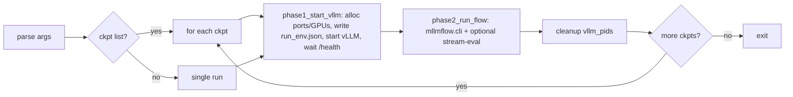

# X-Stream Inference

Minimal, single-entrypoint inference pipeline for the X-Stream multimodal QA
benchmark. One vLLM server (or a hosted API model) per logical model, driven
by [MLLMFlow](https://github.com/guanhuankang/MLLMFlow) for templated
multi-round multimodal prompting, with optional `stream-eval` post-evaluation.

## Architecture



## Layout

```text
inference/
├── run.sh                    unified entrypoint
├── pipeline.sh               sourced bash library
├── tools/                    standalone Python helpers
├── configs/models.example.json
├── tests/make_samples.sh
└── third_party/{MLLMFlow,ModelHub,stream-eval}   vendored local packages
```

## Install

The pipeline is managed with [uv](https://docs.astral.sh/uv/). One command
builds a reproducible Python 3.12 environment that mirrors the venv used to
validate this release (`vllm==0.19.0`, `torch==2.10.0`, `transformers==4.57.3`,
plus the three vendored local packages).

### 0. Prerequisites

| Tool | Version | How to get it |
| ---- | ------- | ------------- |
| `uv` | `>= 0.4` | `curl -LsSf https://astral.sh/uv/install.sh \| sh` |
| `git` | any modern version | distro package manager |
| NVIDIA driver | CUDA 12.8+ runtime (vLLM 0.19 wheels are built against cu12) | check with `nvidia-smi` |
| Disk space | ~10 GB for the venv (torch + flashinfer + nvidia-* wheels) | — |

### 1. Clone the repository

```bash
git clone <repo-url> X-Stream-open-source
cd X-Stream-open-source/inference
```

The three local packages live under `third_party/`:

```text
third_party/MLLMFlow      multimodal flow CLI consumed via `python -m mllmflow.cli`
third_party/ModelHub      HTTP adapters (vLLM-OpenAI, OpenAI, Doubao, ...)
third_party/stream-eval   optional post-inference LLM-as-judge evaluator
```

### 2. Build the environment with uv (one command)

```bash
uv sync --extra local
```

What this does:

1. Reads `pyproject.toml` + `uv.lock` and resolves a deterministic plan.
2. Downloads CPython 3.12.12 under `~/.local/share/uv/python/` if it is
   missing (no system Python touched).
3. Creates `.venv/` in this directory and installs:
   - `vllm==0.19.0` and its full CUDA stack (`torch==2.10.0`,
     `nvidia-cudnn-cu12`, `flashinfer`, `xgrammar`, …)
   - `transformers==4.57.3`, `tokenizers==0.22.x`, `moviepy==2.2.1`,
     `json-repair`, `requests`, `openai`, `aiohttp`, `tqdm`, `numpy`.
   - The three vendored editable packages (`mllmflow`, `model-hub`,
     `stream-eval`) from `third_party/`.
4. Pins everything in `uv.lock` so the build is reproducible bit-for-bit
   on any machine with the same uv version.

Expected wall time on a fresh machine: ~10-15 minutes (vLLM + cu12 wheels
total ~5 GB). If you skip `--extra local`, the third-party packages are
left out and only the PyPI dependencies are installed.

### 3. Activate the venv (or use `uv run`)

```bash
# Option A: activate, then run anything as usual
source .venv/bin/activate
bash run.sh --help

# Option B: never activate, prefix with `uv run`
uv run bash run.sh --help
```

### 4. Configure models (one-time)

```bash
cp configs/models.example.json configs/models.json    # gitignored
# Edit configs/models.json and set any API keys referenced as ${VAR}:
export OPENROUTER_API_KEY=...
export OPENAI_API_KEY=...
```

### 5. Smoke test (5 minutes, no GPU required)

```bash
bash tests/make_samples.sh 10                          # build sample_10_*.jsonl
uv run bash run.sh --no-vllm --model echo \
  --input tests/sample_10_merged.jsonl \
  --multi-stream pixel --no-stream-eval --workers 2 \
  --prompt-root ../path/to/system_prompt --video-root ../data
```

A successful smoke test produces
`outputs/<run-id>_<ts>/output_sample_10_merged.jsonl` with 10 lines and
exits 0. Repeat with `--model <gpu-model>` (no `--no-vllm`) on a CUDA box to
exercise the full vLLM path.

### Updating dependencies later

```bash
uv lock --upgrade        # refresh uv.lock to the latest compatible versions
uv sync --extra local    # apply the new lockfile to .venv/
```

## Quickstart

Single-stream merged videos (the "merge" pipeline):

```bash

source .venv/bin/activate

bash run.sh \
  --model Qwen3-Omni-30B-A3B-Instruct \
  --vllm-model-path /path/to/checkpoints \
  --input ../data/v1/eval_relative_merged_phostream_type.jsonl \
  --multi-stream pixel \
  --tp 2 --workers 4 \
  --max-model-len 32768 \
  --prompt-root /path/to/system_prompt \
  --video-root ../data/v1
```

Two-stream / dual-camera videos (the "double" pipeline) with the legacy
`run_double.sh` default mode:

```bash
bash run.sh \
  --model Qwen3-Omni-30B-A3B-Instruct \
  --input ../data/v1/eval_relative_multi_phostream_type.jsonl \
  --multi-stream code \
  --tp 2 --workers 4
```

Token-reduction modes (CLIP-driven; the encoder loads on GPU inside `mllmflow`):

```bash
bash run.sh ... --multi-stream surge    --surge-rho 0.75
bash run.sh ... --multi-stream cdpruner --cdpruner-keep-ratio 0.5
```

Hosted API model — no local vLLM:

```bash
bash run.sh \
  --model qwen3-vl-30b-a3b-instruct \
  --no-vllm \
  --input ../data/v1/eval_relative_multi_phostream_type.jsonl \
  --multi-stream code \
  --workers 8
```

## Verified end-to-end examples

Four invocations that mirror the legacy `VLLMFlow/projects/run.sh`
(single-stream "merged" pipeline) and `VLLMFlow/projects/run_double.sh`
(two-stream pipeline in `time` mode) under the unified `run.sh`. The results
below were verified with:

```bash
srun --jobid=106536 --overlap --nodes=1 --ntasks=1 bash -lc '<command>'
```

on one H800-x4 node (`hk01dgx054`) after building the README-managed uv
environment with `uv sync --extra local`. Each command uses a 1-sample subset of
the corresponding evaluation file and is shown in the form run from
`X-Stream-open-source/inference`.

> Source inputs:
>
> - `eval_relative_merged_phostream_type.jsonl` → single-stream "merged" videos
>   → drives `--multi-stream pixel`
> - `eval_relative_multi_phostream_type.jsonl` → two-stream "multi" videos →
>   drives `--multi-stream time` (or `code`, `surge`, `cdpruner`)
>
> The 1-row sample files used below come from
> `head -1 tests/sample_10_{merged,multi}.jsonl > tests/sample_1_*.jsonl`.

### Example 1 — `run.sh` ↔ Qwen3-Omni-30B-A3B-Instruct (local vLLM)

```bash
uv run bash run.sh \
  --model Qwen3-Omni-30B-A3B-Instruct \
  --vllm-model-path /path/to/checkpoints \
  --input tests/sample_1_merged.jsonl \
  --multi-stream pixel --no-stream-eval \
  --tp 2 --workers 2 --max-model-len 32768 \
  --run-id job106536_ex1_qwen3omni_pixel_uv \
  --prompt-root /path/to/system_prompt \
  --video-root ../data/v1
```

Verified result (`hk01dgx054`, 4xH800, 2 vLLM instances at TP=2):

- Wall time: 779.97 s (~13.0 min)
- Output: `outputs/job106536_ex1_qwen3omni_pixel_uv_20260512-094224/output_sample_1_merged.jsonl` (1 line, 123,008 bytes)
- Assistant turns produced: 39
- Response distribution: `Silent: 30, D: 5, B: 2, A: 1, C: 1`
- Context/API errors: none found in output
- Exit: 0

### Example 2 — `run.sh` ↔ gemini-3-pro-preview (hosted API, `--no-vllm`)

```bash
uv run bash run.sh \
  --model gemini-3-pro-preview --no-vllm --no-stream-eval \
  --input tests/sample_1_merged.jsonl \
  --multi-stream pixel --workers 1 \
  --api-timeout 30 \
  --run-id job106536_ex2_gemini_pixel_uv \
  --prompt-root /path/to/system_prompt \
  --video-root ../data/v1
```

Verified result:

- Wall time: 201.97 s (~3.4 min; no local vLLM startup)
- Output: `outputs/job106536_ex2_gemini_pixel_uv_20260512-101653/output_sample_1_merged.jsonl` (1 line, 137,060 bytes)
- Pipeline turns attempted: 39
- Exit: 0

The pipeline path is fully exercised. **Important:** the gemini API key inherited from
the legacy `configs/models.json` was rejected or exhausted by the upstream API
(HTTP 401 "该令牌额度已用尽" followed by HTTP 429 "您多次使用无效令牌，请等待 120 秒后再试")
at the time of this run, so `response` fields contain the upstream error string
rather than real model text. Paste a working key into
`configs/models.json -> gemini-3-pro-preview[0].api_key` and the same command
exercises the real hosted model path.

### Example 3 — `run_double.sh` ↔ Qwen3-Omni-30B-A3B-Instruct, `--multi-stream time`

```bash
uv run bash run.sh \
  --model Qwen3-Omni-30B-A3B-Instruct \
  --vllm-model-path /path/to/checkpoints \
  --input tests/sample_1_multi.jsonl \
  --multi-stream time --no-stream-eval \
  --tp 2 --workers 2 --max-model-len 65536 \
  --run-id job106536_ex3_qwen3omni_time_uv \
  --prompt-root /path/to/system_prompt \
  --video-root ../data/v1
```

Verified result (same hardware as Example 1, two-stream input):

- Wall time: 1247.84 s (~20.8 min)
- Output: `outputs/job106536_ex3_qwen3omni_time_uv_20260512-095542/output_sample_1_multi.jsonl` (1 line, 289,280 bytes)
- Assistant turns produced: 39
- Response distribution: `Silent: 30, D: 5, B: 2, A: 1, C: 1`
- Context/API errors: none found in output or log
- `vllm_pids.txt` cleanup: recorded vLLM PIDs torn down after run
- Exit: 0

`--multi-stream time` interleaves the two-camera segments frame-by-frame inside
`mllmflow`'s video assembler; the larger output size vs. Example 1 reflects the
doubled video token budget routed through vLLM. A first pass with
`--max-model-len 32768` completed the pipeline but produced vLLM 400 responses
on late turns (`Input length ... exceeds model's maximum context length`), so
the verified command above uses `65536`.

### Example 4 — `run_double.sh` ↔ gemini-3-pro-preview, `--multi-stream time`

```bash
uv run bash run.sh \
  --model gemini-3-pro-preview --no-vllm --no-stream-eval \
  --input tests/sample_1_multi.jsonl \
  --multi-stream time --workers 1 \
  --api-timeout 30 \
  --run-id job106536_ex4_gemini_time_uv \
  --prompt-root /path/to/system_prompt \
  --video-root ../data/v1
```

Verified result:

- Wall time: 377.16 s (~6.3 min; dominated by two-stream video decoding and API retries)
- Output: `outputs/job106536_ex4_gemini_time_uv_20260512-102024/output_sample_1_multi.jsonl` (1 line, 303,408 bytes)
- Pipeline turns attempted: 39
- Exit: 0

Same caveat as Example 2: the legacy API key was rejected/exhausted, so
`response` fields contain 429 upstream error strings. Substitute a live
`api_key` in `configs/models.json` to reproduce real model answers.

> ### Scaling to the full eval
>
> Drop the `tests/sample_1_*.jsonl` for the production file:
>
> ```bash
> --input ../data/v1/eval_relative_merged_phostream_type.jsonl   # for ex1/ex2
> --input ../data/v1/eval_relative_multi_phostream_type.jsonl    # for ex3/ex4
> ```
>
> and raise `--workers` (e.g. `--workers 8` for API models, `--workers 4` per
> vLLM instance for local models). All four invocations are idempotent under
> `--resume`.

## Multi-stream / token-reduction modes

| Mode            | Use when                                                           |
| --------------- | ------------------------------------------------------------------ |
| `pixel`         | single-stream input (default; merged videos)                       |
| `time`          | two streams; interleave A1 B1 A2 B2 frame-by-frame                 |
| `code`          | two streams; pick the higher-change stream per segment             |
| `code_adaptive` | `code` + adapt pixel size by per-segment change quantity           |
| `cdpruner`      | CDPruner-style instruction+diversity token selection (loads CLIP)  |
| `surge`         | SURGE-style temporal-surprise video token pruning (loads CLIP)     |

`cdpruner` and `surge` engage only when each round contains ≥2 video specs;
on single-stream inputs they degrade silently to `pixel` behaviour.

## Multi-checkpoint sweeps

Loop one full run per checkpoint. `--resume` is auto-enabled so finished
checkpoints are skipped and unfinished ones continue in their existing
RUN_DIR:

```bash
bash run.sh \
  --model Qwen3.5-9B \
  --ckpt /weights/ck-1500 \
  --ckpt /weights/ck-3000 \
  --input ../data/v1/eval_relative_merged_phostream_type.jsonl \
  --multi-stream pixel
```

Or use a list file:

```text
# checkpoints.txt
/weights/ck-1500
/weights/ck-3000
```

```bash
bash run.sh --ckpt-list-file checkpoints.txt --model Qwen3.5-9B --input ...
```

## Resume

`--resume` reuses the newest matching `outputs/<RUN_ID>__<ts>/` whose
`run_env.json` matches the current invocation and which has not finished
processing every input row. Already-processed rows are skipped via
`mllmflow --resume`.

```bash
bash run.sh --resume --model Qwen3-Omni-30B-A3B-Instruct --input ... --multi-stream pixel
```

## Output layout

Every run produces a directory under `--output-dir` (default `outputs/`):

```text
outputs/<RUN_ID>_<YYYYMMDD-HHMMSS>/
├── run_env.json                resolved env (resume key, audit trail)
├── models.json                 per-run config with local vLLM endpoints
├── output_<input>.jsonl        mllmflow inference output
├── eval.sh                     stream-eval invocation (if --stream-eval)
├── eval.json                   stream-eval scores
├── vllm_pids.txt               PIDs we own (cleaned up automatically)
└── vllmlogs/<port>.log         per-instance vLLM stdout+stderr
```

## Full flag reference

```text
--model NAME              logical key in configs/models.json (required)
--input JSONL             input task list (required)
--run-id ID               default "demo"
--output-dir DIR          default ./outputs
--config FILE             default configs/models.json
--workers N               mllmflow concurrency (default 4)
--tp N                    vLLM tensor parallel size (default 2)
--vllm-model-path DIR     local checkpoint root for vLLM
--no-vllm                 skip vLLM startup (API-only models)
--gpu-mem-util F          vLLM --gpu-memory-utilization (default 0.85)
--max-model-len N         vLLM --max-model-len
--ckpt PATH               repeatable; loop one run per checkpoint
--ckpt-list-file FILE     one path per line, '#' and blank lines ignored
--resume                  reuse newest matching incomplete run
--multi-stream MODE       pixel|time|code|code_adaptive|cdpruner|surge
--surge-rho FLOAT         FLOW_SURGE_RHO (default 0.75)
--cdpruner-keep-ratio F   FLOW_CDPRUNER_KEEP_RATIO (default 0.5)
--prompt-root DIR         {{file:...}} root
--video-root DIR          {{video:...}} root
--image-root DIR          {{image:...}} root
--cache-dir DIR           decoded-frame / segment cache (default ./cache)
--drop-audio              FLOW_DROP_AUDIO=true
--api-timeout SECS        per-request timeout (default 600)
--stream-eval / --no-stream-eval
--stream-eval-judger M    default qwen3-235b-a22b-instruct-2507
```

## Testing

```bash
# Build the 10-row smoke inputs (gitignored).
bash tests/make_samples.sh 10

# Orchestration smoke (no GPU; uses an OpenRouter-hosted model).
bash run.sh --no-vllm --model qwen3-vl-30b-a3b-instruct \
  --input tests/sample_10_merged.jsonl --multi-stream pixel

# GPU runs.
bash run.sh --model Qwen3-Omni-30B-A3B-Instruct --tp 2 \
  --input tests/sample_10_merged.jsonl --multi-stream pixel
bash run.sh --model Qwen3-Omni-30B-A3B-Instruct --tp 2 \
  --input tests/sample_10_multi.jsonl  --multi-stream code
```

## Troubleshooting

- **vLLM never becomes ready on `/health`.** Inspect
  `outputs/<run>/vllmlogs/<port>.log` for OOM / model-load errors. Try a
  larger `--tp`, smaller `--max-model-len`, or `--gpu-mem-util 0.7`.
- **Port already in use.** `tools/get_free_ports.py` retries random ports
  but cannot reach into someone else's namespace; pin via
  `VLLM_PORT_LIST=12345;12346` if you need deterministic ports.
- **API 4xx/429.** ModelHub backs off and retries; if it never succeeds the
  most common cause is an API key without multimodal entitlement.
- **`--multi-stream code` produces single-stream output.** The input JSONL
  must have ≥2 `{{video:...,step=...}}` per round; check that you're using
  `eval_relative_multi_phostream_type.jsonl` (or equivalent) rather than
  the merged variant.

## License

This repository is released under the [MIT License](LICENSE).

Vendored code under `third_party/` comes from upstream projects
([MLLMFlow](https://github.com/guanhuankang/MLLMFlow),
[ModelHub](https://github.com/guanhuankang/ModelHub)) and local `stream-eval`;
retain their respective notices and attribution as in each subtree.
