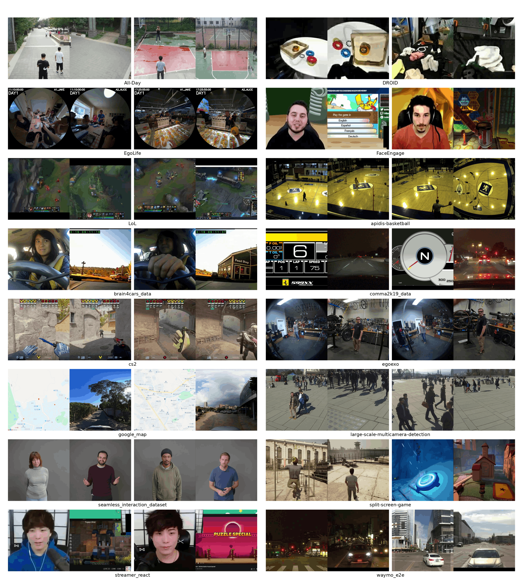
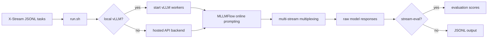
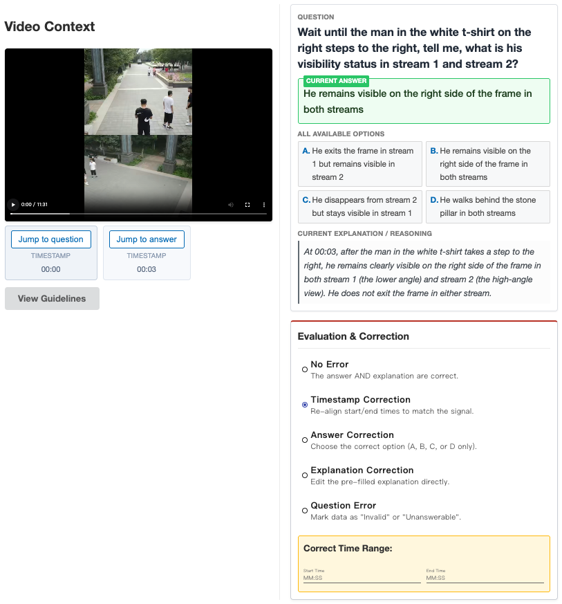
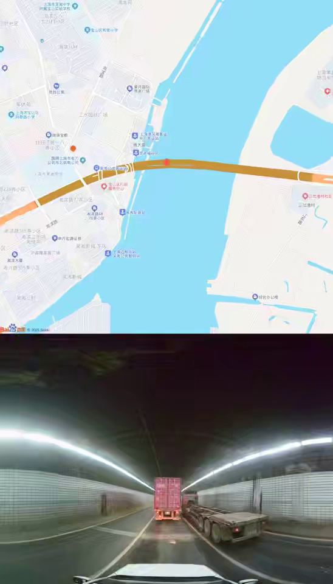

# X-Stream Inference

[](https://peiwensun2000.github.io/xstream/)
[](https://huggingface.co/datasets/spw2000/X-stream)
[](https://peiwensun2000.github.io/xstream/)
[](LICENSE)

<p align="center"></p>

Official inference code for **X-Stream: Exploring MLLMs as Multiplexers for Multi-Stream Understanding**. This directory provides a reproducible online inference pipeline for evaluating multimodal large language models (MLLMs) on multi-stream streaming video question answering.

The implementation supports local vLLM serving, hosted API models, multi-checkpoint sweeps, resumable runs, and several multi-stream multiplexing strategies used in the paper.

## Abstract

While video streaming understanding has made significant strides, real-world applications, such as live sports broadcasting, autonomous driving, and multi-screen collaboration, inherently demand continuous, multi-stream interactions. However, existing benchmarks are confined to single-stream paradigms, leaving a critical gap in evaluating online, cross-stream reasoning. To bridge this, we introduce **X-Stream**, the **first benchmark** dedicated to **multi-stream** streaming understanding. Comprising **4,220 rigorously curated QA pairs across 932 videos**, X-Stream evaluates **11 subtasks** across multi-window, multi-view, and multi-device scenarios. Crucially, our dataset is constructed using a novel **dual-verification pipeline** that prevents over-reliance on a single stream. Furthermore, we conceptualize MLLMs as **naive multiplexers** and evaluate them through the lens of Signal Multiplexing Theory. Extensive online inference experiments show that current state-of-the-art MLLMs struggle with concurrent streams, achieving only about **50% score** and exhibiting weak proactive ability.

## Overview



X-Stream evaluates whether a model can continuously monitor multiple synchronized video streams and answer at the right time. The benchmark covers multi-window, multi-view, and multi-device scenarios, with tasks spanning visual/audio/temporal grounding, counting, saliency detection, spatial reasoning, causal reasoning, anomaly detection, and behavior planning.

This inference package is designed for the paper evaluation setting:

- **Online streaming input**: video is processed round by round instead of as a single offline clip.
- **Multi-stream reasoning**: questions require anti-interference, cross-stream reference alignment, or cooperation across streams.
- **Multiplexing strategies**: multiple videos are combined into one model-consumable token stream using spatial, temporal, or semantic division.
- **LLM-as-a-judge evaluation**: optional post-evaluation is available through the vendored `stream-eval` package.

## Method And Pipeline





The benchmark source material and figures are adapted from the ECCV manuscript under `../ECCV`. The dataset construction follows four major stages: preprocessing, QA generation with timestamps, sufficiency/necessity verification to remove single-stream shortcuts, and expert human verification.

## Repository Layout

```text
inference/
|-- run.sh                         # unified inference entrypoint
|-- pipeline.sh                    # bash library for vLLM, resume, and evaluation
|-- configs/
|   `-- models.example.json        # model registry template
|-- tests/
|   `-- make_samples.sh            # build small smoke-test JSONLs
|-- tools/                         # helper scripts
|-- third_party/
|   |-- MLLMFlow                   # online multimodal prompt execution
|   |-- ModelHub                   # API/vLLM adapters
|   `-- stream-eval                # optional LLM-as-a-judge evaluation
|-- assets/                        # README figures adapted from ECCV assets
`-- outputs/                       # generated run directories
```

## Installation

### Requirements

- Linux with a recent NVIDIA driver for local vLLM inference.
- CUDA-compatible GPUs for open-source MLLM checkpoints.
- `uv >= 0.4` for reproducible Python environment management.
- Python is managed by `uv`; the project pins Python `>=3.12,<3.13`.

Install `uv` if needed:

```bash
curl -LsSf https://astral.sh/uv/install.sh | sh
```

Create the environment from the lock file:

```bash
cd X-Stream-open-source/inference
uv sync --extra local
```

This installs the local orchestration package, `vllm==0.19.0`, `transformers==4.57.3`, video processing dependencies, and the vendored `MLLMFlow`, `ModelHub`, and `stream-eval` packages.

Activate the environment, or prefix commands with `uv run`:

```bash
source .venv/bin/activate
bash run.sh --help
```

## Data Preparation

The public dataset description follows the Hugging Face-style README in `../data/v3/readme.md`. The released v3 manifests are JSON Lines files despite the `.json` suffix:

```text
data/v3/
|-- eval_relative.json
|-- train_relative.json
`-- readme.md
```

For this inference runner, use MLLMFlow-ready JSONL task files. The current repository includes prepared examples in earlier data snapshots:

```text
data/v1/eval_relative_merged_phostream_type.jsonl   # merged multi-window videos, use --multi-stream pixel
data/v1/eval_relative_multi_phostream_type.jsonl    # per-stream videos, use --multi-stream time/code/...
data/v2/{strict,loose}/eval_relative_*.jsonl        # alternative prepared splits
```

If you are starting from the v3 release manifest, keep paths relative to the dataset root and convert each verified QA into the MLLMFlow JSONL prompt format expected by `run.sh`. In all cases, pass the dataset root through `--video-root` so `{{video:...}}` resources resolve correctly.

Build 10-row smoke-test inputs from a prepared data directory:

```bash
# Defaults to ../data/v1. Override with X_STREAM_DATA_DIR when needed.
X_STREAM_DATA_DIR=../data/v1 bash tests/make_samples.sh 10
```

## Model Configuration

Copy the example registry and fill in local checkpoints or API keys:

```bash
cp configs/models.example.json configs/models.json
export OPENROUTER_API_KEY=...
export OPENAI_API_KEY=...
export QWEN_ENDPOINT=...
export QWEN_API_KEY=...
```

A logical model name in `configs/models.json` is selected with `--model`. For local vLLM models, `run.sh` rewrites the selected backend to point at the vLLM server it starts. For hosted API models, add `--no-vllm`.

## Quickstart

### 1. Smoke Test Without GPU

The `echo` backend verifies orchestration, file resolution, resume bookkeeping, and output writing without calling a real MLLM:

```bash
uv run bash tests/make_samples.sh 10
uv run bash run.sh   --model echo   --no-vllm   --input tests/sample_10_merged.jsonl   --multi-stream pixel   --no-stream-eval   --workers 2   --prompt-root ../data   --video-root ../data/v1
```

### 2. Local vLLM Inference

Use this path for open-source checkpoints such as Qwen3-Omni or Qwen3-VL:

```bash
uv run bash run.sh   --model Qwen3-Omni-30B-A3B-Instruct   --vllm-model-path /path/to/checkpoint   --input ../data/v1/eval_relative_multi_phostream_type.jsonl   --multi-stream time   --tp 2   --workers 4   --max-model-len 65536   --prompt-root /path/to/system_prompt   --video-root ../data/v1
```

### 3. Hosted API Inference

Use this path for API-backed models:

```bash
uv run bash run.sh   --model qwen3-vl-30b-a3b-instruct   --no-vllm   --input ../data/v1/eval_relative_merged_phostream_type.jsonl   --multi-stream pixel   --workers 8   --prompt-root /path/to/system_prompt   --video-root ../data/v1
```

## Multi-Stream Modes

| Mode | Paper interpretation | Recommended input |
| --- | --- | --- |
| `pixel` | Spatial division multiplexing. Streams are tiled or merged at pixel level. | Merged video JSONL |
| `time` | Time division multiplexing. Stream frames are interleaved with stream identifiers. | Per-stream JSONL |
| `code` | Semantic stream selection based on per-segment change. | Per-stream JSONL |
| `code_adaptive` | `code` plus adaptive pixel-size allocation. | Per-stream JSONL |
| `cdpruner` | Token-reduction baseline inspired by CDPruner. | Per-stream JSONL |
| `surge` | Token-reduction baseline inspired by SURGE. | Per-stream JSONL |

`cdpruner` and `surge` rely on additional visual encoding inside `MLLMFlow`. For single-stream or already merged inputs, prefer `pixel`.



## Outputs

Each run writes a timestamped directory under `--output-dir`:

```text
outputs/<RUN_ID>_<YYYYMMDD-HHMMSS>/
|-- run_env.json                 # resolved arguments and resume key
|-- models.json                  # per-run model registry with vLLM endpoints
|-- output_<input>.jsonl         # raw MLLMFlow responses
|-- eval.sh                      # generated stream-eval command, if enabled
|-- eval.json                    # judge scores, if enabled
|-- vllm_pids.txt                # vLLM processes owned by this run
`-- vllmlogs/<port>.log          # vLLM stdout/stderr logs
```

Use `--resume` to continue the newest compatible incomplete run:

```bash
uv run bash run.sh --resume --model Qwen3-Omni-30B-A3B-Instruct --input ... --multi-stream time
```

## Evaluation

By default, `run.sh` enables `stream-eval` after inference. Disable it when you only need raw responses:

```bash
uv run bash run.sh ... --no-stream-eval
```

Choose a different judge model with:

```bash
uv run bash run.sh ... --stream-eval-judger qwen3-235b-a22b-instruct-2507
```

The paper reports online streaming scores for Instant, Backward, Forward, and Comprehensive questions, plus multi-stream ability scores including Single Stream, Multi-Stream Cooperation, Cross-Stream Reference, and Cross-Stream Interference.

## Reproducing Paper-Style Runs

A reproducible experiment should record:

- Git commit and dataset version.
- Input JSONL path and split type.
- Model name, checkpoint path, tensor parallel size, and max context length.
- Multiplexing mode and token-reduction parameters.
- `run_env.json`, raw output JSONL, and `eval.json`.

Example checkpoint sweep:

```bash
uv run bash run.sh   --model Qwen3-Omni-30B-A3B-Instruct   --ckpt /path/to/ckpt-1500   --ckpt /path/to/ckpt-3000   --input ../data/v1/eval_relative_multi_phostream_type.jsonl   --multi-stream time   --resume
```

## Troubleshooting

- **vLLM does not become healthy**: inspect `outputs/<run>/vllmlogs/<port>.log`, reduce `--gpu-mem-util`, reduce `--max-model-len`, or increase `--tp`.
- **Input file not found**: `run.sh` resolves paths to absolute paths before entering the run directory; check `--input`, `--video-root`, and `--prompt-root`.
- **API 401/429 errors**: verify that the configured API key has multimodal entitlement and enough quota.
- **Unexpected single-stream behavior**: make sure per-stream experiments use `eval_relative_multi_phostream_type.jsonl` or an equivalent converted JSONL with multiple video resources per round.
- **Forward questions score poorly**: the model must answer within the configured response window; early or missing responses are penalized.

## Citation

If you use X-Stream or this inference pipeline, please cite:

```bibtex
@inproceedings{sun2026xstream,
  title     = {X-Stream: Exploring MLLMs as Multiplexers for Multi-Stream Understanding},
  author    = {Sun, Peiwen and Lu, Xudong and Liu, Huadai and Bo, Yang and Wu, Dongming and Guan, Huankang and Cai, Minghong and Chen, Jinpeng and Guo, Xintong and Li, Shuhan and Liu, Rui and Yue, Xiangyu},
  booktitle = {ECCV},
  year      = {2026}
}
```

## License

This inference package is released under the [MIT License](LICENSE). Third-party packages under `third_party/` retain their original licenses and notices. Dataset files may have separate terms; check the dataset release and `../data/v3/readme.md` before redistribution.
